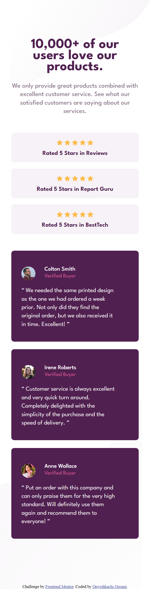
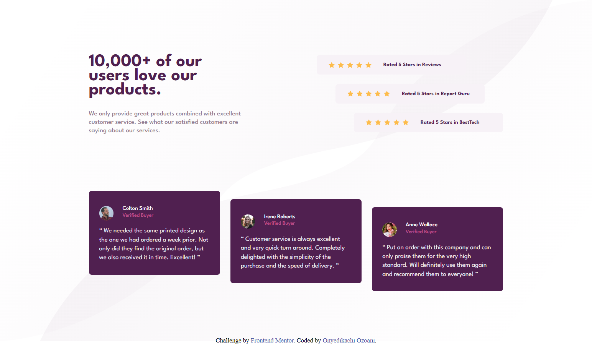

<!-- @format -->

# Frontend Mentor - Social proof section solution

This is a solution to the [Social proof section challenge on Frontend Mentor](https://www.frontendmentor.io/challenges/social-proof-section-6e0qTv_bA). Frontend Mentor challenges help you improve your coding skills by building realistic projects.

## Table of contents

- [Frontend Mentor - Social proof section solution](#frontend-mentor---social-proof-section-solution)
  - [Table of contents](#table-of-contents)
  - [Overview](#overview)
    - [The challenge](#the-challenge)
    - [Screenshot](#screenshot)
    - [Links](#links)
  - [My process](#my-process)
    - [Built with](#built-with)
    - [What I learned](#what-i-learned)
  - [Author](#author)
  - [Acknowledgments](#acknowledgments)

## Overview

### The challenge

Users should be able to:

-   View the optimal layout for the section depending on their device's screen size

### Screenshot

Mobile design - 
Desktop design - 

### Links

-   Solution URL: [The solution posted on Frontend Mentor](https://www.frontendmentor.io/solutions/done-using-flexbox-and-grid-layout-SdkMA_SzuA)
-   Live Site URL: [visit the live site](https://social-proof-section-nerdynerd.netlify.app/)

## My process

### Built with

-   Semantic HTML5 markup
-   CSS custom properties
-   Flexbox
-   CSS Grid
-   Mobile-first workflow

### What I learned

-   During the development of this project, I was able to exercise my understanding of **CSS Grid Layout**.

## Author

-   Frontend Mentor - [@OnyedikachiOzoani](https://www.frontendmentor.io/profile/OnyedikachiOzoani)
-   Stack Overflow - [@coding-nerd](https://stackoverflow.com/users/21363556/coding-nerd)

## Acknowledgments

All thanks to [Frontend Mentor](https://www.frontendmentor.io/) for sharing this project.

**Thanks for checking out for my project.**
